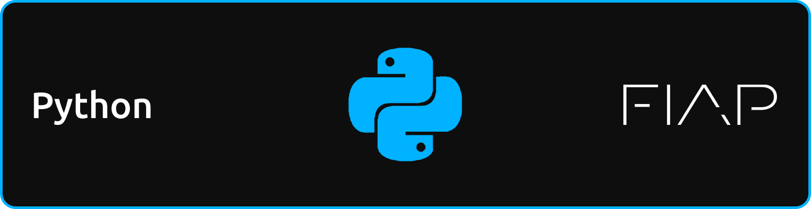

# CRIADOR
- **[Kaique Rodrigues Zaffarani](https://github.com/Z4ffarani)**

<br>

# INTRODUÇÃO
O Pensamento Computacional é uma habilidade fundamental no mundo digital atual, permitindo que indivíduos abordem problemas complexos de maneira estruturada e eficiente. Ele envolve a decomposição de problemas, o reconhecimento de padrões, a abstração e a criação de algoritmos para desenvolver soluções eficazes.

Quando associado a uma linguagem de programação como **[Python](https://www.python.org)**, o Pensamento Computacional se torna uma ferramenta poderosa, acessível tanto para iniciantes quanto para desenvolvedores experientes. Python, com sua sintaxe clara e recursos abrangentes, é amplamente utilizado para introduzir conceitos de programação e Pensamento Computacional de forma prática e intuitiva.

<br>

# FUNDAMENTOS
- **Decomposição** | Consiste em dividir um problema complexo em partes menores e mais gerenciáveis. No contexto do Python, isso pode se manifestar na divisão de um programa em funções ou módulos, onde cada componente aborda uma parte específica do problema.

- **Reconhecimento de Padrões** | Identificar padrões em dados ou processos ajuda a prever comportamentos e a reutilizar soluções. Com Python, o reconhecimento de padrões pode ser implementado através de estruturas de repetição, como loops, ou utilizando bibliotecas como **[Pandas](https://pandas.pydata.org/docs/)** para análise de dados.

- **Abstração** | Implica em concentrar-se nos aspectos importantes do problema, ignorando detalhes irrelevantes. Em Python, a abstração pode ser alcançada criando classes e objetos que encapsulam os detalhes internos e expõem apenas o necessário para o usuário.

- **Algoritmos** | São sequências de instruções passo a passo para resolver problemas. Com Python, os algoritmos podem ser implementados de maneira simples e legível, graças à sintaxe intuitiva da linguagem. Além disso, Python possui uma vasta gama de bibliotecas que facilitam a criação e o uso de algoritmos complexos.

<br>

# DESENVOLVIMENTO
- **Resolução de Problemas Matemáticos** | Python é amplamente utilizado para resolver problemas matemáticos que envolvem cálculos complexos, álgebra linear e estatística. Com bibliotecas como **[NumPy](https://numpy.org/doc/stable/)** e **[SciPy](https://docs.scipy.org/doc/scipy/)**, é possível implementar algoritmos matemáticos de forma eficiente, permitindo aos alunos aplicar o pensamento computacional em cenários matemáticos reais.

- **Automação de Tarefas** | O pensamento computacional aplicado com Python permite a automação de tarefas repetitivas, como manipulação de arquivos, scraping de dados da web e envio de e-mails automatizados. Essa automação não só economiza tempo, mas também reduz a probabilidade de erros humanos.

- **Análise de Dados** | Python, em combinação com bibliotecas como Pandas, **[Matplotlib](https://matplotlib.org/stable/users/index)** e **[Seaborn](https://seaborn.pydata.org/tutorial.html)**, oferece uma poderosa plataforma para análise de dados. O Pensamento Computacional ajuda a estruturar o processo de análise, desde a coleta e limpeza dos dados até a visualização e interpretação dos resultados.

- **Desenvolvimento de Jogos e Simulações** | Criar jogos e simulações é uma excelente maneira de aplicar o pensamento computacional, pois envolve a criação de algoritmos complexos e a simulação de comportamentos. Com bibliotecas como **[Pygame](https://www.pygame.org/docs/)**, é possível desenvolver jogos interativos que testam os limites da criatividade e lógica do programador.

- **Ensino do Pensamento Computacional com Python** | Altamente eficaz em contextos educativos, permite que os alunos aprendam conceitos de programação de maneira prática e envolvente. Iniciativas como o uso de **[Jupyter Notebooks](https://docs.jupyter.org/en/latest/)** em sala de aula facilitam a interação com o código, promovendo um ambiente de aprendizado mais dinâmico. Exercícios de codificação que envolvem a resolução de pequenos problemas, como criar algoritmos para calcular a sequência de Fibonacci ou determinar se um número é primo, ajudam a praticar a decomposição e a criação de algoritmos.

<br>

# VANTAGENS
- **Clareza e Simplicidade** | A sintaxe do Python é limpa e legível, o que facilita a compreensão e a implementação de algoritmos.
  
- **Comunidade e Suporte** | A vasta comunidade de Python proporciona um ambiente rico em recursos e suporte para aprendizagem e desenvolvimento.
  
- **Versatilidade** | Python é uma linguagem versátil, usada em várias áreas como ciência de dados, desenvolvimento web, automação e mais.
  
- **Escalabilidade** | Embora seja simples o suficiente para iniciantes, Python também é poderoso o bastante para resolver problemas complexos em nível industrial.

<br>

# CONCLUSÃO
O Pensamento Computacional com Python é uma combinação poderosa para resolver problemas de forma lógica e eficiente. Ele não apenas capacita alunos e profissionais a compreenderem e abordarem problemas complexos, mas também os prepara para um mundo onde a automação e a análise de dados desempenham um papel crucial. Com Python, o aprendizado do Pensamento Computacional se torna uma jornada acessível e empolgante, cheia de possibilidades de inovação e descobertas.

<br>

# OBSERVAÇÕES
- O projeto consiste em uma coleção de anotações realizadas durante aulas ao longo do ano letivo na instituição **[FIAP](https://www.fiap.com.br)**. Essas anotações incluem conceitos principais abordados na disciplina, resumos de conteúdos, exemplos práticos e exercícios resolvidos. O objetivo é organizar e consolidar o conhecimento adquirido em sala de aula, servindo como material de apoio para revisões e estudos futuros.

<br>

# INSTRUÇÕES
1. Em um terminal, clonar o repositório:
```bash
git clone https://github.com/Z4FFARANI-STUDY/COMPUTATIONAL-THINKING-WITH-PYTHON.git
```

2. No terminal, navegar até a pasta do projeto:
```bash
cd COMPUTATIONAL-THINKING-WITH-PYTHON
```

3. Acessar o conteúdo das aulas adiante da pasta `SEM1` ou `SEM2`.
